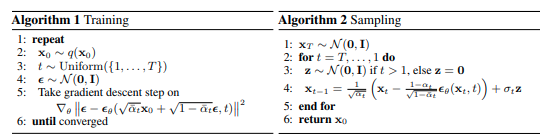
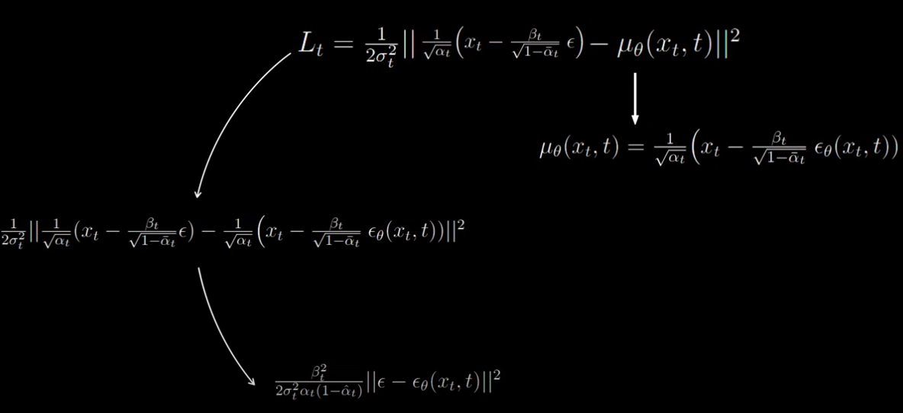

## Stable Diffusion Implementation Repo

### Introduction
This repository is used to track my learnings and implementations of the Stable Diffusion algorithm. The goal of the project is to implement the Stable Diffusion algorithm and test it on a simple toy problem. The project is currently in development and is not yet at a stable state.
This is more of a theoretical project to understand the Stable Diffusion algorithm and its applications.

### Sources
The code is highly inspired by the notebook https://colab.research.google.com/drive/1sjy9odlSSy0RBVgMTgP7s99NXsqglsUL?usp=sharing#scrollTo=Rj17psVw7Shg

### Algorithm 
The training and sampling algorithm from the paper (https://arxiv.org/pdf/2006.11239.pdf) is used:

For reference, the formula of line 4 of algorithm 2 can be derived with: 

if we insert (1 - alpha_t) = beta_t and neglect the constant factor, we get the formula of line 4.
The image is from [https://www.youtube.com/watch?v=HoKDTa5jHvg&t=994s]