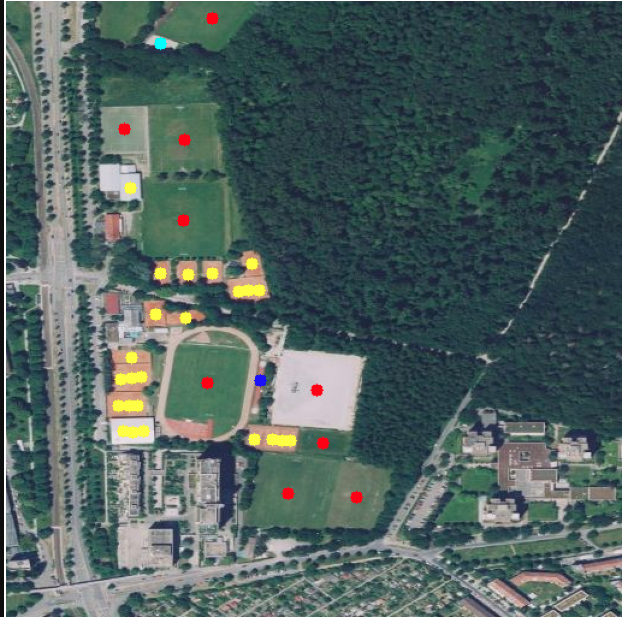
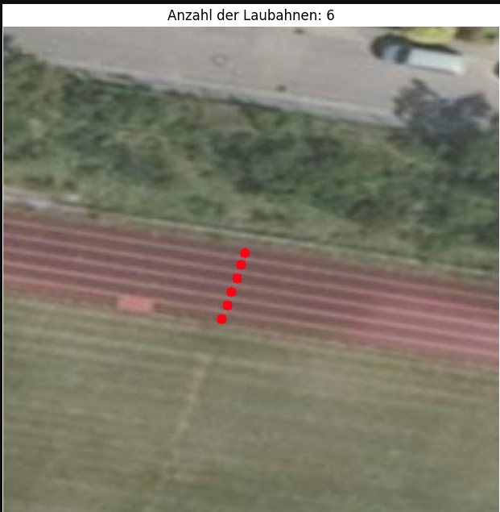

# Center Point Detection Models

## Overview

This repository introduces Center Point Detection models, a novel approach to object detection that deviates from the traditional use of bounding boxes. Instead of encompassing the entire object within a rectangular box, our models focus on identifying the exact center points of objects. This methodology is particularly advantageous for detecting objects with non-rectangular shapes or when precise localization is required.

## Why Center Point Detection?

- **Accuracy**: Pinpoints the exact center, offering a precise location of objects within an image.
- **Efficiency**: Reduces computational overhead by eliminating the need for bounding box calculations.
- **Suitability for Irregular Shapes**: Ideal for objects that do not conform to rectangular boundaries.
- **Application Versatility**: From human pose estimation to aerial vehicle detection, center point detection offers broad utility without the constraints of bounding boxes.

### Ideal Use Cases

- **Counting Objects**: When the task focuses on the quantity rather than the dimensions of objects.
- **Keypoint and Landmark Detection**: For accurately locating specific points of interest on objects, such as facial features or anatomical keypoints.
- **Surveillance and Monitoring**: Useful in scenarios where detecting the presence and movement of objects is more critical than determining their size.

### Limitations

While center point detection offers numerous advantages, it's important to note that it does not capture the size or scale of objects. Therefore, it might not be suitable for tasks where object dimensions are essential.

## Applications

- **Human Pose Estimation**: Determining human joints and points of interest with high precision.
- **Facial Landmark Detection**: Identifying key facial features for security, augmented reality, and more.
- **Aerial Vehicle Detection**: Detecting and tracking drones or other flying objects where orientation and shape vary significantly.
- **Automated Retail and People Counting**: Counting products or individuals in retail environments or public spaces.

## Example 
### Find sport fields on a satelite image
Here Center Points are detected for a football field, a running track and a tennis court. 
The postprocessed detection looks like this:

### Count number of lanes on a running track
Here Center Points were determined for each running track to count the number of parallel tracks

## Getting Started

Explore my models and documentation to see how Center Point Detection can be applied to your projects. Whether you're enhancing existing applications or embarking on new challenges, my approach provides a fresh perspective on object detection.

Join us in advancing the field of object detection by focusing on the core of what matters: the precise location and identification of objects in any given image.
